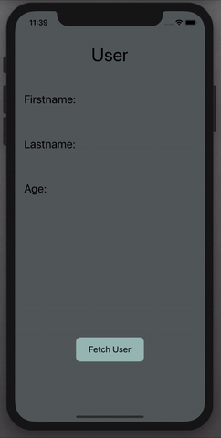

# display-user
A simple iOS app that displays users from a dictionary.

## Why I made this app and what I learned

I created this app to learn more about Swift as well as how to add and fetch data from a dictionary. 

Here is a gif of what the app looks like!

